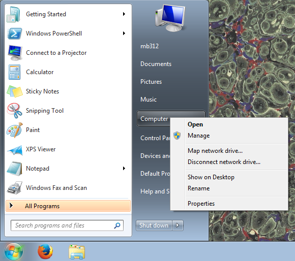
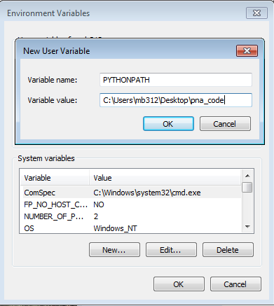

################################
Putting stuff on the Python path
################################

Remember the Python path?

.. nbplot::

    >>> import sys
    >>> print('\n'.join(sys.path))
    ...

We are going to be using the modules in ``fmri-methods-2015/for_exercises``
this week.

It may get tiring to keep doing:

::

    import sys
    sys.path.append('/Users/mb312/code/fmri-methods-2015/for_exercises')

Is there any easier way?

Why yes - there is. In fact there are several.

The one we are going to use is the ``PYTHONPATH`` environment variable
(see https://docs.python.org/2/using/cmdline.html#envvar-PYTHONPATH).

If you are on a Mac
~~~~~~~~~~~~~~~~~~~

-  Open ``Terminal.app``;
-  Open the file ``~/.bash_profile`` in your text editor;
-  Add the following line to the end:

   ::

       export PYTHONPATH=$HOME/code/fmri-methods-2015/for_exercises

Save the file. \* Close ``Terminal.app``; \* Start ``Terminal.app``
again, and type this:

::

    echo $PYTHONPATH

It should show something like
``/Users/your_username/fmri-methods-2015/for_exercises``. If not, come get one
of us.

If you are on Linux
~~~~~~~~~~~~~~~~~~~

-  Open your favorite terminal program;
-  Open the file ``~/.bashrc`` in your text editor;
-  Add the following line to the end:

   ::

       export PYTHONPATH=$HOME/fmri-methods-2015/for_exercises

   Save the file.
-  Close your terminal application;
-  Start your terminal application again, and type this:

   ::

       echo $PYTHONPATH

It should show something like
``/home/your_username/fmri-methods-2015/for_exercises``. If not, come get one
of us.

If you are on Windows
~~~~~~~~~~~~~~~~~~~~~

Got to the Windows menu, right-click on "Computer" and select
"Properties":

From the computer properties dialog, select "Advanced system settings"
on the left:

From the advanced system settings dialog, choose the "Environment
variables" button:

.. image:: win_env_vars.png

In the Environment variables dialog, click the "New" button in the top
half of the dialog, to make a new *user* variable:

Give the variable name as ``PYTHONPATH`` and the value is the path to
the ``fmri-methods-2015/for_exercises`` directory. Choose OK and OK again to
save this variable.

Now open a ``cmd`` Window (Windows key, then type ``cmd`` and press
Return). Type:

::

    echo %PYTHONPATH%

to confirm the environment variable is correctly set:

.. image:: win_cmd_echo.png

If you want the IPython notebook to see this new ``PYTHONPATH``
variable, you may need to close your terminal, open it again, and
restart ``ipython notebook``, so that it picks up ``PYTHONPATH`` from
the environment settings.

You can check the current setting of environment variables, using the
``os.environ`` dictionary:

.. nbplot::

    >>> import os
    >>> os.environ['PYTHONPATH']

